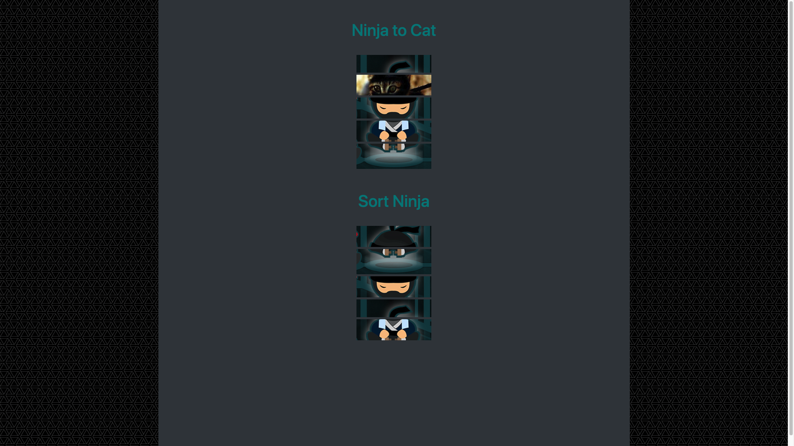

# NinjaToCatSort
This page has images that when hovered over change to reveal a different picture. If the new picture is clicked, the new picture becomes the default picture. If it
is clicked on again it reverts back to the original image. The second section of this page showcases unsorted images that can be moved around until all the images are sorted.
  
# What I learned
* Learned about data-alternates in HTML
* Used .hover() and .click() to change images
* Used .sortable() to make images movable
 
  
# Screenshots

